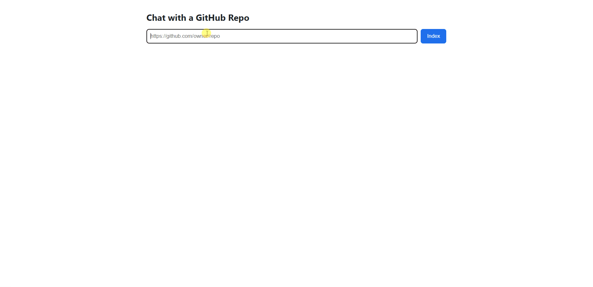
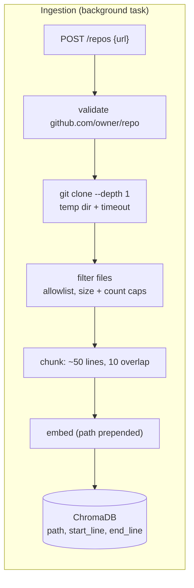
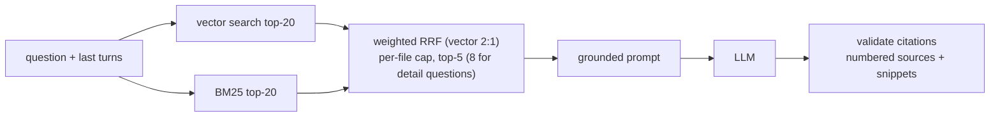

# Chat with a GitHub Repo


Paste a public GitHub repo URL. The app clones and indexes it, then answers questions like *"How does the token bucket work?"* or *"Why do the Lua scripts use Redis TIME?"* with **citations to exact files and line ranges** that link back to GitHub.

**Live demo:** https://repochat.duckdns.org



**What makes it more than a generic RAG demo**

- Async ingestion with live status (`cloning → indexing → ready / failed`)
- Hybrid retrieval (vector + BM25) and a **measured evaluation**, including a negative result
- Citations are **validated** against the retrieved lines; anything the model cites that it was not given is dropped
- Refuses to guess: unanswerable questions return "not found" with no sources
- Public-demo hardening: URL allowlist, size caps, per-IP rate limits, repo dedupe and expiry

## How it works





**Design decisions**

| Decision                                                    | Why                                                                                           |
| ----------------------------------------------------------- | --------------------------------------------------------------------------------------------- |
| Line-based chunks with ~10 lines of overlap                 | A function split at a boundary is still retrievable with its context                          |
| File path prepended to the text before embedding            | Names and paths carry signal that the code body alone lacks                                   |
| Hybrid retrieval, fused with Reciprocal Rank Fusion         | Identifiers favor keyword search, concepts favor embeddings; RRF needs no score normalization |
| Per-file cap in the merged results                          | Docs and tests repeat identifiers and otherwise crowd real code out of the top-k              |
| Citations parsed and checked against retrieved lines        | The model can only cite code it was actually shown                                            |
| Short follow-ups borrow the previous question for retrieval | "Explain that in more detail" has no searchable topic on its own                              |
| LLM behind a small provider-agnostic interface              | The provider can be swapped without touching retrieval                                        |

## Evaluation

**Setup.** 37 hand-written questions on a repo I know well ([`rate-limiter`](https://github.com/kushal281/rate-limiter): FastAPI service plus Redis Lua scripts). 34 are answerable and each lists the file(s) that should be retrieved; 3 are unanswerable on purpose. Metric: **hit@k**, meaning at least one expected file appears in the top-k retrieved chunks. Questions are tagged `easy` (single file) or `multi` (several files). The labels were fixed before any hybrid experiments.

**Retrieval (34 answerable questions)**

| Retrieval mode                                                         | hit@1         | hit@3         | hit@5         |
| ---------------------------------------------------------------------- | ------------- | ------------- | ------------- |
| Vector only (baseline)                                                 | **32%** | **74%** | 88%           |
| Hybrid, plain RRF                                                      | 21%           | 59%           | 82%           |
| Hybrid + per-file cap (2)                                              | 21%           | 65%           | 88%           |
| **Hybrid, weighted RRF (vector 2:1) + cap (2)**, used in the app | 29%           | 71%           | **91%** |

By question type at hit@5: easy 91% for both vector and the shipped mode; multi-file 83% → 92%.

**What I learned**

- Plain hybrid was **worse** than vector. `README.md` and test files repeat identifiers, so BM25 ranked them highly and RRF let them push real code out of the top 5.
- Capping chunks per file and weighting vector 2:1 recovered the baseline and ended slightly ahead at hit@5 (+1 question). **With 34 questions that difference is within noise**, and the weights were tuned on the same set, so I treat it as "no regression, small possible gain", not a proven improvement.
- Three questions miss in every mode (Redis key naming, fixed-window denial behavior, multi-worker benchmarking). That points to chunking and labeling, not fusion, and is the first thing I would look at next.

**Grounding check.** All 3 unanswerable questions returned "I couldn't find this in the retrieved code." with zero sources (3/3). A positive control ("which file defines the POST /check route?") cited `app/main.py` (1/1).

**Reproduce**

```bash
python -m eval.run_eval <repo_id> vector        # also: hybrid, hybrid_cap, hybrid_w2
python -m eval.run_checks <repo_id>             # refusal + citation checks
```

## API

| Method | Route                | Purpose                                                                                          |
| ------ | -------------------- | ------------------------------------------------------------------------------------------------ |
| POST   | `/repos`           | `{url}` starts ingestion, returns `repo_id` (an already-indexed URL returns its existing id) |
| GET    | `/repos/{id}`      | Status (`cloning`, `indexing`, `ready`, `failed`) and chunk count                        |
| POST   | `/repos/{id}/chat` | `{question, history}` returns `{answer, sources:[{id, path, start, end, snippet}]}`          |
| DELETE | `/repos/{id}`      | Remove the index and its metadata                                                                |
| GET    | `/health`          | Liveness and whether an LLM key is configured                                                    |

## Run it

**Locally**

```bash
pip install -r requirements.txt
cp .env.example .env          # Windows: copy .env.example .env, then add your LLM key
uvicorn app.main:app --reload
```

Open http://127.0.0.1:8000.

**Docker**

```bash
docker build -t repo-chat .
docker run --rm -p 8000:8000 --env-file .env -v repo-chat-data:/data repo-chat
```

The embedding model is downloaded at build time, so the container does not fetch it on first request. In the image, repos expire after 24 hours of inactivity and at most 20 are kept (`REPO_TTL_HOURS`, `MAX_REPOS`); locally both are off.

**Tests**

```bash
python -m pytest -q
```

CI runs the same command on every push.

## Safety and limits

- Only `https://github.com/{owner}/{repo}` URLs are accepted; clones run in a temp directory with a timeout, and repo code is never executed.
- File allowlist, per-file size cap (200 KB), max 2000 files per repo.
- Per-IP rate limits (10 repo indexings per hour, 20 questions per 10 minutes), question length and history caps, and readable errors when the model is busy or its quota is used up.

## Limitations

- Public repos only; shallow clone of the default branch (no history).
- Large repos cost more time and embedding work; the index is not refreshed until it expires and is re-created.
- Answers use only the top few retrieved chunks, so questions that need reasoning across many files can be incomplete.
- The evaluation covers one repo and 34 questions, and the retrieval settings were tuned on that same set.
- Rate limiting and the BM25 cache are in-process, so they assume a single worker. Container storage is ephemeral.
- `DELETE` is unauthenticated (ids are random, but this is not access control).
- The LLM is on a free tier with a daily request quota, which limits how many people can use a public demo.

## Stack

Python 3.12, FastAPI, ChromaDB, sentence-transformers (`all-MiniLM-L6-v2`), `rank_bm25`, SQLite, Gemini behind a small provider interface, vanilla HTML/JS frontend, Docker, GitHub Actions.
